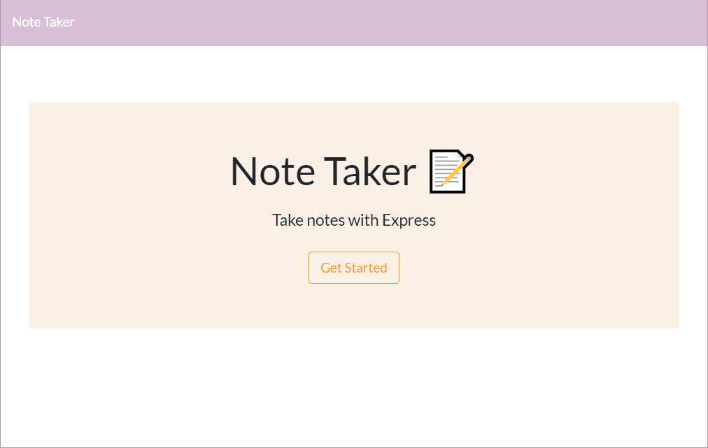

# Express.js Note Taker :pencil2:

#### 📍 [View Deployment on Heroku](https://katsign-note-taker.herokuapp.com/) 📍

### This note-taking app uses an Express server to store input data.

## *Table of Contents*

- [Description](#description)
- [Installation](#installation)
- [Usage](#usage)
- [Screenshots](#screenshots)
- [Contributing](#contributing)
- [Contact](#contact)

## *Description*
Note Taker uses an Express server to store input user data in a database and display it on a landing page. Simply put — you can write and display notes!

## *Installation*
### Navigate into the repository folder on your local machine and open the built-in terminal. You will need Node.js installed to run this application.
- Type `npm i` on the command line to install Express.
- Type `node server.js` to spin up the local server.
- Then, type `npm run watch` and navigate to `http://localhost:3000/` in your browser to see the application in action.

## *Usage*
### Note Taker allows you to view both the posted input data as listed 'Notes' and those actual JSON objects in the database at different endpoints in the app.
- From the homepage, when you click `Get Started` you are taken to the `/notes` endpoint. This displays the two test notes already saved in the database and an interface to begin typing a new `Note Title` and `Note Text`.
- Write your new note and click the save icon that appears up top to post to the database. This will also append to the list of notes on the left.
- To view the JSON objects, type this path into your browser while running the local server: `http://localhost:3000/api/notes`.

## *Screenshots*

## *Contributing*
Contributing is welcome, raise issues and submit through pull requests.

## *Contact*
🔗 Links in Bio @[katsign](https://github.com/katsign)

---
This project is MIT licensed. &copy; 2021
